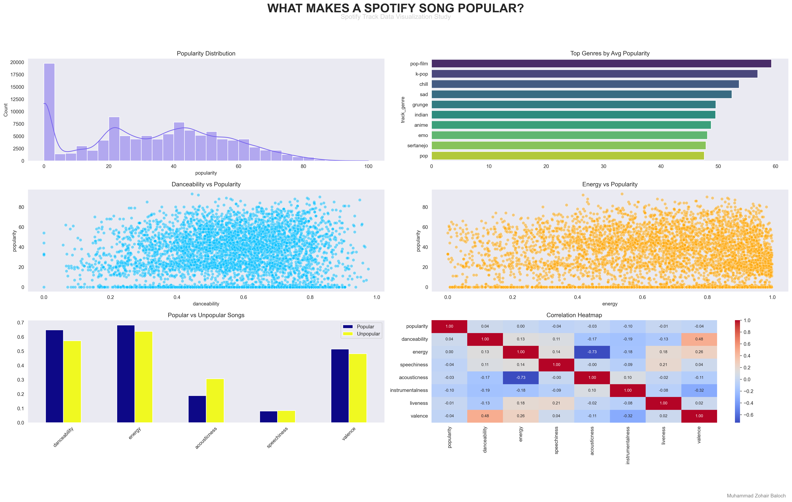

# 🎵 What Makes a Spotify Song Popular?

## A Data Visualization Study Using Spotify Track Data

## 📌 Project Overview

This project explores Spotify track data to understand the factors associated with song popularity.

Using data visualization techniques, the analysis investigates how audio characteristics such as danceability, energy, acousticness, and genre relate to track popularity.

The objective is to transform raw music data into meaningful insights and identify patterns that contribute to successful songs.

---

## 🎯 Research Questions

* What is the distribution of song popularity?
* Which genres achieve the highest popularity?
* Do explicit songs perform differently?
* Is danceability associated with popularity?
* Does energy influence popularity?
* How do audio characteristics differ between popular and unpopular songs?

---

## 📊 Dashboard Preview

The dashboard summarizes the key visual insights from the analysis.

### Dashboard Components

* Popularity Distribution
* Top Genres by Average Popularity
* Danceability vs Popularity
* Energy vs Popularity
* Popular vs Unpopular Song Features
* Correlation Heatmap

---

## 🛠 Technologies Used

* Python
* Pandas
* NumPy
* Matplotlib
* Seaborn
* Jupyter Notebook

---

## 📂 Dataset Information

Dataset: Spotify Tracks Dataset

Key Features:

* Track Name
* Artist
* Genre
* Popularity
* Danceability
* Energy
* Acousticness
* Instrumentalness
* Speechiness
* Valence
* Tempo
* Explicit Content Indicator

---

## 📈 Key Findings

### 1. Popular Songs Are Rare

Most tracks fall within low to moderate popularity ranges, while highly popular songs represent only a small portion of the dataset.

### 2. Genre Matters

Certain genres consistently achieve higher average popularity than others.

### 3. Danceability Shows Strong Influence

Popular songs generally exhibit higher danceability levels compared to less popular tracks.

### 4. Energy Alone Is Not Enough

High-energy songs exist across all popularity levels, suggesting that energy alone does not determine success.

### 5. Popular Songs Have Distinct Characteristics

Popular and unpopular songs display noticeable differences across several audio features.

### 6. Popularity Is Multifactorial

No single feature strongly predicts popularity. Song success appears to be influenced by a combination of characteristics.

---

## 🚀 Project Outcome

This project demonstrates how data visualization can be used to uncover meaningful patterns in music streaming data and answer business-oriented analytical questions.

Rather than simply creating charts, the analysis focuses on understanding the characteristics associated with song popularity.

---

## 👨‍💻 Author

Muhammad Zohair Baloch

Data Analytics Intern | Aspiring Data Analyst
